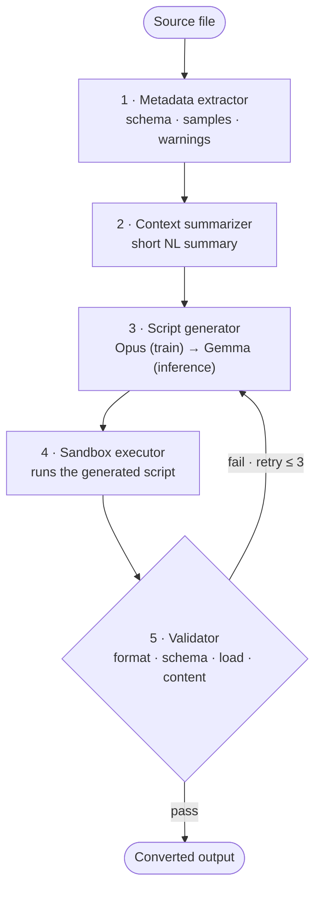

<div align="center">

# data morph

**Convert messy CSV / JSON / TXT files with a 2 GB language model that runs locally — for free.**

[](https://pypi.org/project/data-morph-gemma/)
[](https://www.python.org/)
[](LICENSE)
[](https://lovemig6334.github.io/data-morph/)
[](https://huggingface.co/Bunnana/data-morph-gemma-2b)
[](https://huggingface.co/datasets/Bunnana/data-morph-conversions)

📖 **[Documentation](https://lovemig6334.github.io/data-morph/)** ·
🚀 **[Quickstart](https://lovemig6334.github.io/data-morph/quickstart/)** ·
✨ **[Showcase](https://lovemig6334.github.io/data-morph/showcase/)** ·
📦 **[PyPI](https://pypi.org/project/data-morph-gemma/)**

</div>

---

Rule-based parsers can't handle messy, context-dependent file conversions; frontier LLMs
can, but they're expensive at scale and send your data to a third party. **data morph**
distills that conversion ability from **Claude Opus** into a **2.0 GB Gemma student** that
runs entirely on your machine — reaching **~96 % of the teacher's accuracy** at a fraction
of the size.

```python
from datamorph import convert_file

result = convert_file("contacts.csv", "contacts.json")
print(result.accepted, result.scores)   # True {'format_validity': 1.0, 'loadability': 1.0}
```

## Install

Runs on **Apple Silicon** via [MLX](https://github.com/ml-explore/mlx):

```bash
pip install "data-morph-gemma[mlx]"
```

The 2.0 GB model **downloads automatically** from the Hugging Face Hub on first use (cached
under `~/.cache/huggingface`). To point at a local copy instead, set `GEMMA_MLX_MODEL`.

> **Import vs. install name:** the distribution is **`data-morph-gemma`** (`pip install`),
> but the import name is **`datamorph`**.

## Usage

**Python**

```python
from datamorph import convert_file

# formats are auto-detected from extensions
result = convert_file("orders.csv", "orders.json")

# …or set them explicitly, and add guidance
result = convert_file(
    "app.log", "events.csv",
    input_format="txt", output_format="csv",
    instruction="Columns: timestamp, level, source, message.",
)

result.accepted      # did the output pass validation?
result.scores        # {'format_validity': 1.0, 'loadability': 1.0}
result.script        # the Python script the model wrote
result.output_path   # where it was written
```

**Command line**

```bash
datamorph convert orders.csv orders.json
datamorph convert app.log --output-format csv > events.csv   # pipe to stdout
datamorph --version
```

Exit codes: `0` converted & validated · `1` ran but failed validation · `2` usage/input error.

See the **[Showcase](https://lovemig6334.github.io/data-morph/showcase/)** for real, messy
files converted end to end.

## How it works

Conversion is a **five-stage pipeline**, not a single model call. The model never sees the
full source file — only a small **metadata envelope** (schema, samples, warnings). From
that it writes a Python script, which is run in a sandbox and validated.



Narrowing the task from "transform a whole file" to "read metadata, write a script" is what
makes a small local model viable — and because the model never reads full content, it
**scales to arbitrary file sizes** and leaves a **readable, debuggable** artefact: the
script. Full details in the [docs](https://lovemig6334.github.io/data-morph/how-it-works/).

## Supported conversions

CSV, JSON, and TXT, in five patterns: **CSV→JSON** (nested), **JSON→CSV** (flatten),
**TXT log→CSV**, **CSV→TXT** (report), and **schema migration**.

## Results

Evaluated through the full pipeline on a 70-case held-out test set (content-disjoint from
training), scored on four metrics — Format Validity, Schema Compliance, Loadability,
Content Accuracy.

| Artifact | params | size | retry ≤ 3 | % of teacher |
|---|---:|---:|---:|---:|
| fine-tuned (bf16) | 5.12 B | 9.6 GB | — | — |
| fused · text-only · vocab-16k (bf16) | 2.05 B | 3.8 GB | 69/70 (0.986) | ~99 % |
| **+ 8-bit — shipped** | **2.05 B** | **2.0 GB** | **67/70 (0.957)** | **~96 %** |

A three-step model surgery (fuse the LoRA adapter → strip the unused vision/audio towers →
prune the vocabulary 262 k → 16 k → 8-bit quantize) shrinks the student **9.6 GB → 2.0 GB
(−79 %)** while staying well above the ≥ 80 %-of-teacher target on every metric.

## Contributing & development

Built from source with [`uv`](https://docs.astral.sh/uv/) on **Python 3.12**:

```bash
git clone https://github.com/LoveMig6334/data-morph
cd data-morph
uv sync                 # creates .venv + installs the package (editable) + dev tools
uv run pytest           # run the test suite
uv run mkdocs serve     # preview the docs locally
```

Project layout:

```
datamorph/            the installable package (import name: datamorph)
  convert.py          public API — convert_file() + ConversionResult
  cli.py              the `datamorph` command-line interface
  model.py            model resolution (local path / $GEMMA_MLX_MODEL / HF Hub)
  extractor/          metadata extractor — CSV, JSON, TXT
  evaluation/         the four metrics + baseline runner
  data/               synthetic generators, sandbox, teacher + collection orchestrator
  features/           verified pairs → chat JSONL + disjoint split
  models/             MLX inference + a hosted (OpenRouter) client
scripts/              corpus generation, pair collection, dataset build, baselines, model surgery
skills/               Agent-Skill prompts used to generate training data
tests/                unit tests + fixtures
docs_src/             documentation site sources (MkDocs Material)
```

Contributions are welcome — please open an issue or PR. Run `uv run pytest` and
`uv run ruff check` before submitting.

## Limitations

- A small model: reliable on the five trained conversion patterns; messy but in-pattern
  inputs are handled well, far-out-of-distribution ones may fail (the pipeline validates
  and retries, but does not guarantee success).
- Hallucination / data-loss risk is mitigated — not eliminated — by automated
  format/schema validation at inference time.
- Teacher (Claude Opus) bias can propagate to the student.
- Converted files may contain personal data; everything runs locally — no inputs are uploaded.

## License & credits

- **Code:** [MIT](LICENSE).
- **Model:** a derivative of Google's **Gemma**, governed by the
  [Gemma Terms of Use](https://ai.google.dev/gemma/terms); distilled from **Claude Opus**.
- **Model & data:** [`data-morph-gemma-2b`](https://huggingface.co/Bunnana/data-morph-gemma-2b)
  · [`data-morph-conversions`](https://huggingface.co/datasets/Bunnana/data-morph-conversions).
