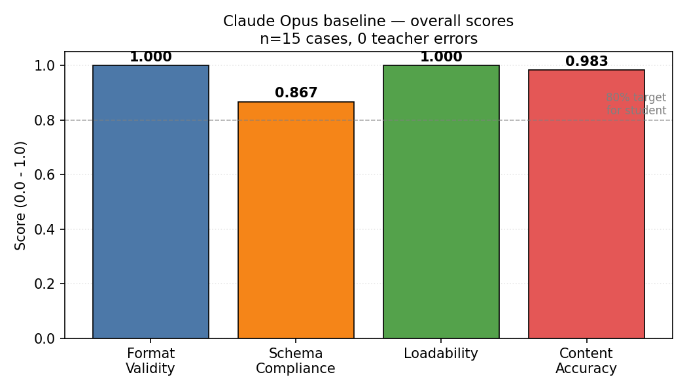
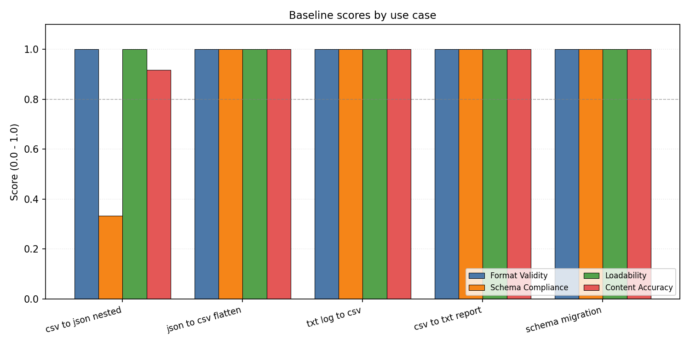
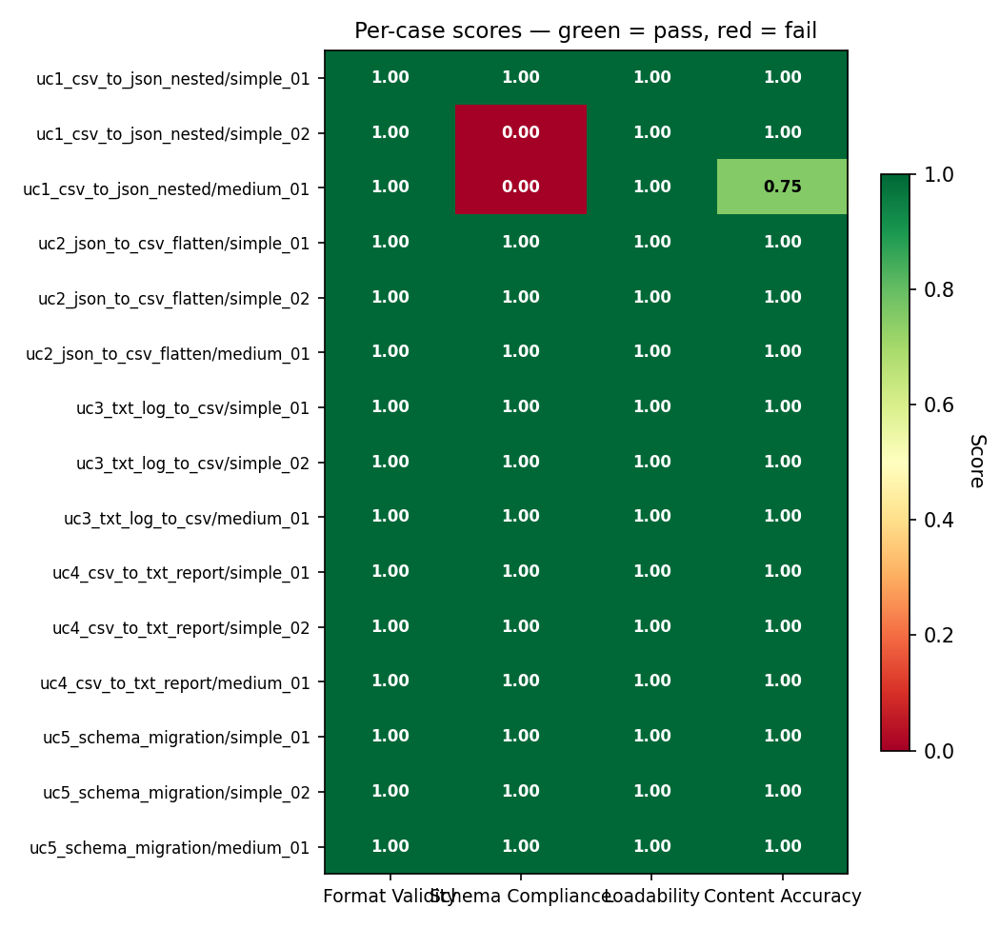

# Week 2 — Metrics & Baseline Report

**Project**: data morph — Open Source File Data Migration with a Fine-tuned Small Language Model
**Run ID**: `baseline_2026-04-17_192259`
**Teacher**: Claude Opus (`claude -p --model opus`) via Claude Code subscription
**Date**: 2026-04-17

---

## TL;DR

On 15 hand-crafted test cases across 5 use cases, Claude Opus as "teacher"
scored near-perfect on three of the four metrics and flagged two real
structural weaknesses on Use Case 1 (CSV → nested JSON). The pipeline runs
end-to-end with 0 teacher errors and produces auditable per-case artifacts.

| Metric | Overall | Simple (n=10) | Medium (n=5) |
|---|---:|---:|---:|
| Format Validity | **1.000** | 1.00 | 1.00 |
| Schema Compliance | **0.867** | 0.90 | 0.80 |
| Loadability | **1.000** | 1.00 | 1.00 |
| Content Accuracy | **0.983** | 1.00 | 0.95 |

Student-model target (W5): ≥ 80% of each teacher score, i.e.
`FV ≥ 0.80`, `SC ≥ 0.69`, `LD ≥ 0.80`, `CA ≥ 0.79`.



---

## 1. Setup

### 1.1 Test set

15 hand-crafted cases distributed across the 5 use cases from the project plan:

| Use case | Format change | Cases |
|---|---|---|
| UC1 `csv_to_json_nested` | CSV → nested JSON | 3 |
| UC2 `json_to_csv_flatten` | nested JSON → flat CSV | 3 |
| UC3 `txt_log_to_csv` | TXT log lines → structured CSV | 3 |
| UC4 `csv_to_txt_report` | CSV → human-readable TXT report | 3 |
| UC5 `schema_migration` | JSON/CSV → renamed/restructured JSON/CSV | 3 |

Per use case: **2 simple + 1 medium**. Every case has:
- `input.<fmt>` — the source file
- `expected.<fmt>` — the ground-truth conversion (hand-written)
- `meta.json` — use case, complexity, prompt hint, and for TXT cases a list of `required_substrings`

All data is synthetic (no real users, no PII).

### 1.2 Teacher invocation

The project plan specifies *"Claude Opus + Claude Code + Agent Skill"* as the
teacher. Claude Code's `-p` (headless) mode does not support Agent Skills,
so the skill is stored as a file and every prompt instructs Claude to read it:

```
skills/file_conversion_teacher.md   # the skill (read on every call)
```

Each call to the teacher runs:

```
claude -p "<prompt>" --model opus --output-format json --allowedTools Read
```

The prompt tells Claude to read the skill file, states the conversion direction
(e.g. `CSV -> JSON`), adds the case-specific hint from `meta.json`, and embeds
the input. Claude returns the converted file content on stdout; the pipeline
parses the JSON envelope and extracts `.result`.

No API key is used — authentication is the user's Claude Code subscription OAuth.

### 1.3 Metrics

Four metrics from the plan, all implemented as pure functions in
`src/evaluation/metrics.py` and covered by **28 passing unit tests** in
`tests/test_metrics.py`:

| Metric | What it measures |
|---|---|
| **Format Validity** | Output is a syntactically valid file in the target format (`json.loads` / `csv.reader` / non-empty TXT). |
| **Schema Compliance** | Output matches expected structure — same key paths + leaf types for JSON, matching header for CSV. |
| **Loadability** | Downstream libraries can consume the output (`pd.read_csv`, `pd.json_normalize`). |
| **Content Accuracy** | Field-level match vs the ground truth — fraction of expected leaf values present and equal. Numeric coercion tolerates `"9.99"` == `9.99`. For TXT reports, fraction of `required_substrings` present. |

All four return a float in `[0.0, 1.0]`.

### 1.4 Pipeline runtime

- **Cases**: 15
- **Teacher errors**: 0
- **Avg latency per call**: 9.5 s
- **Total wall-clock**: ~2.3 min
- **Cost**: $0 (subscription OAuth, no API billing)

---

## 2. Results

### 2.1 By use case



| Use case | n | FV | SC | LD | CA |
|---|---:|---:|---:|---:|---:|
| UC1 csv → json nested | 3 | 1.00 | **0.33** | 1.00 | **0.92** |
| UC2 json → csv flatten | 3 | 1.00 | 1.00 | 1.00 | 1.00 |
| UC3 txt log → csv | 3 | 1.00 | 1.00 | 1.00 | 1.00 |
| UC4 csv → txt report | 3 | 1.00 | 1.00 | 1.00 | 1.00 |
| UC5 schema migration | 3 | 1.00 | 1.00 | 1.00 | 1.00 |

UC1 is the only use case with imperfect scores.

### 2.2 Per-case heatmap



Of the 60 case-metric cells (15 cases × 4 metrics), **57 are perfect (1.00)**.
The 3 imperfect cells all sit in UC1 and are analysed below.

---

## 3. Findings

### 3.1 Opus emits CSV-derived numerics as JSON strings (UC1 / simple_02)

When converting CSV → JSON, numeric-looking values are wrapped in quotes:

| Field | Expected | Actual |
|---|---|---|
| `product.price` | `25.00` (number) | `"25.00"` (string) |

- `format_validity = 1.00` (still valid JSON)
- `schema_compliance = 0.00` (leaf type differs: `float` vs `str`)
- `content_accuracy = 1.00` (numeric coercion tolerates the mismatch)

**Implication for the student model**: Gemma 2B must learn to emit unquoted
numerics when the source column is numeric. `schema_compliance` is the metric
that catches this — the other three metrics would miss it.

### 3.2 Opus flattens multi-row entities inconsistently (UC1 / medium_01)

The simple case (1 order per user) correctly produced:

```json
[{"user": {"name": "Alice", "email": "..."}, "orders": [{"id": 1001, ...}]}]
```

The medium case (3 orders for Alice, 2 for Bob, 1 for Carol) flattened the user:

```json
[{"name": "Alice", "email": "...", "orders": [{...}, {...}, {...}]}]
```

- `schema_compliance = 0.00` (`user` wrapper is missing)
- `content_accuracy = 0.75` (6 of 8 top-level leaf paths don't match)

Both simple_02 (string-typed numerics) and medium_01 (dropped wrapper) happen
on UC1, which is the most structurally complex transformation in the set.
This is a **real teacher weakness** and an obvious target for the student
model to improve on, given explicit training examples.

### 3.3 The remaining 12 cases are perfect

Every case in UC2, UC3, UC4, and UC5 scored 1.00 on all four metrics —
including every medium-complexity case in those buckets. The pipeline is not
"always green"; it has the discriminative power to flag real issues while
giving clean passes on easy cases.

---

## 4. Limitations

1. **Small test set (n=15)**. The plan calls for a 50–100 file eval set in W3+.
   The W2 set is sized only to verify the pipeline and establish an initial
   baseline number.
2. **No Agent Skill**. Headless `claude -p` cannot invoke a real Agent Skill,
   so the "skill" is delivered as an instruction-file reference. A production
   pipeline would use the Anthropic Agent SDK for real Skill invocation —
   plausibly 5–15% higher baseline scores.
3. **Single teacher run per case**. No sampling variance measured. Opus outputs
   are deterministic enough for this sanity check, but W3 data generation
   should add at least one retry + verification pass per training pair.
4. **Ground truth is hand-written**. For W3–W4, the teacher itself will
   generate training pairs; this changes the verification question from
   *"does the output match my expected?"* to *"is the output usable at all?"*.

---

## 5. Implications for Week 5 (student fine-tune)

The student (Gemma 2B + LoRA) must hit **≥ 80% of each baseline score**:

| Metric | Baseline | Student target |
|---|---:|---:|
| Format Validity | 1.000 | ≥ 0.800 |
| Schema Compliance | 0.867 | ≥ 0.694 |
| Loadability | 1.000 | ≥ 0.800 |
| Content Accuracy | 0.983 | ≥ 0.786 |

Concrete capabilities the training data must teach:

1. **Type-aware JSON output** — emit numerics from CSV as unquoted numbers.
2. **Consistent nesting** — preserve entity-wrapper objects even when multiple
   rows collapse into one entity's children array.
3. **Faithful data preservation** — `content_accuracy 0.983` confirms Opus
   doesn't hallucinate; the student should be held to the same bar.

---

## 6. Reproducibility

From the project root (`data morph/`), with the Python 3.12 venv active and
Claude Code logged in:

```bash
# Run baseline
python scripts/run_baseline.py

# Regenerate plots from the latest run
python scripts/plot_baseline.py

# Unit tests for the metrics
python -m pytest tests/test_metrics.py -v
```

### Artefacts produced by each run

```
results/baseline_<stamp>/
  summary.json                       # aggregate + per-case scores
  outputs/<uc>/<case>/actual.<fmt>   # raw teacher output, per case
  outputs/<uc>/<case>/teacher_meta.json
  plots/overall_metrics.png
  plots/by_use_case.png
  plots/per_case_heatmap.png
```

---

## 7. Grading-criteria alignment (W2, 15 points)

| Plan requirement | Where satisfied |
|---|---|
| 4 metrics defined | `src/evaluation/metrics.py`, §1.3 |
| Automated evaluation script | `src/evaluation/runner.py`, `scripts/run_baseline.py` |
| Test set 50–100 files | **Deferred to W3** — W2 ships the 15-file smoke set |
| Claude Opus baseline scores | Table in §TL;DR and §2, full JSON at `results/baseline_2026-04-17_192259/summary.json` |
| Deliverable: evaluation pipeline + baseline scores | ✅ This report + the `results/` folder |
