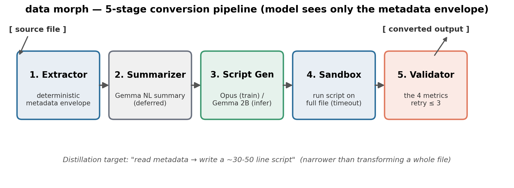
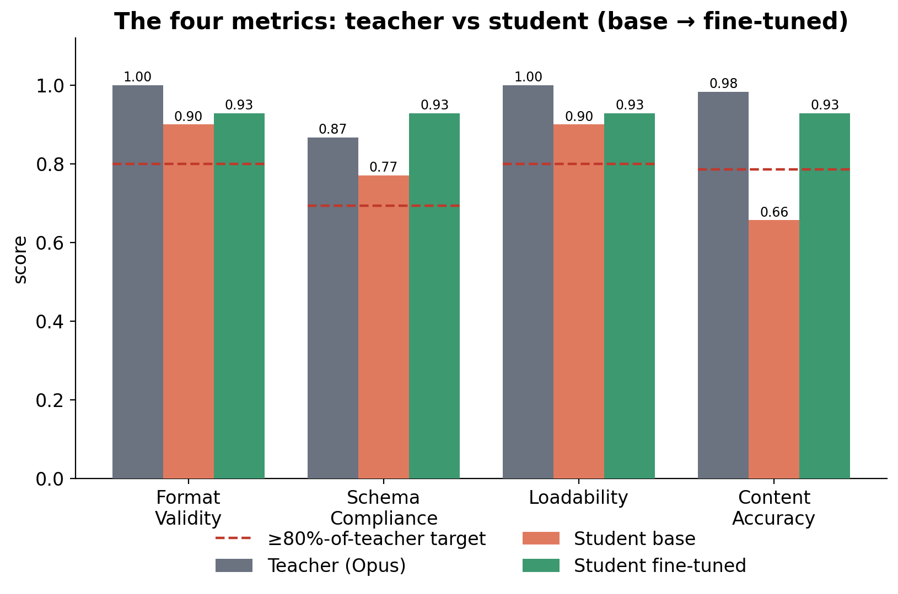
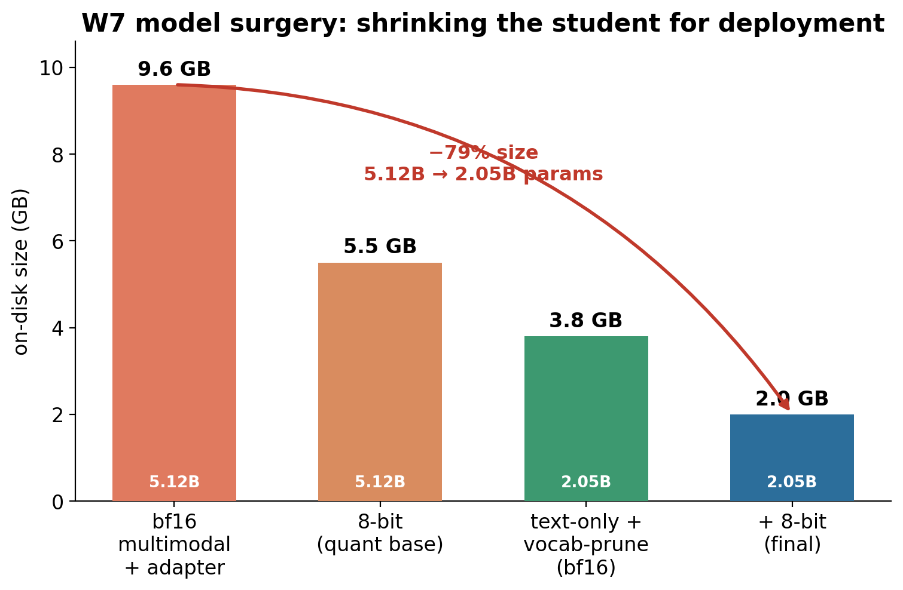

# How it works

Conversion is a **five-stage pipeline**, not a single end-to-end model call. The model
only ever sees a small structured **metadata envelope**, never the full source file.



```
[source file]
    ├─→ 1. Metadata extractor   deterministic — schema + samples + warnings
    ├─→ 2. Context summarizer   Gemma base — short NL summary (deferred)
    ↓
    3. Script generator   Claude Opus (training) → Gemma student (inference)
    ↓ emits an executable Python conversion script
    4. Sandbox executor   deterministic — runs the script (timeout + CPU limit)
    ↓ converted output file
    5. Validator          the four metrics — format, schema, load, content
    ↓
[output file]
```

1. **Metadata extractor** — deterministic. Produces the envelope: schema, sample values,
   and warnings (24 rules), for CSV, JSON, and TXT.
2. **Context summarizer** — a short natural-language summary of the envelope. Deferred (an
   inference-time nicety, not needed to collect training data).
3. **Script generator** — the heart of the system. Claude Opus writes the script during
   training; the fine-tuned Gemma student writes it at inference. Output is an
   `<analysis>` block followed by a `<script>` block.
4. **Sandbox executor** — runs the generated script on the real source file in a
   subprocess with a timeout and CPU limit.
5. **Validator** — scores the output on the four metrics below.

## Why this shape

Narrowing the distillation target from "transform a whole file" (impractical for a 2 B
model) to "read metadata, write a script" (realistic) is what makes a small local model
viable. Because the model never sees full file content, the pipeline **scales to arbitrary
file sizes**, and every conversion leaves a **readable, debuggable artefact** — the script.

## The four metrics

1. **Format Validity** — output loads with `json.load()` / `csv.reader()` / etc.
2. **Schema Compliance** — expected structure / JSON Schema passes.
3. **Loadability** — pandas (or the downstream library) can consume it.
4. **Content Accuracy** — field-level comparison vs. source; no hallucination, no data loss.

At inference, the public API checks Format Validity + Loadability (no answer key exists for
a real file) and retries on failure; training additionally required Schema Compliance = 1.0
and Content Accuracy ≥ 0.95 before a pair was accepted.



## From teacher to a 2.0 GB student

- **Teacher:** Claude Opus generated **800 programmatically-verified** training pairs.
- **Student:** `mlx-community/gemma-4-e2b-it-bf16`, fine-tuned with **LoRA**.
- **Compression:** fuse the adapter → strip the unused vision + audio towers → prune the
  262 k vocabulary to 16 k → quantize to 8-bit.



The result holds **~96 % of teacher accuracy** at retry ≤ 3 — above the project's
≥ 80 %-of-teacher target on every metric. The model + training data are public:
[model](https://huggingface.co/Bunnana/data-morph-gemma-2b) ·
[dataset](https://huggingface.co/datasets/Bunnana/data-morph-conversions).
